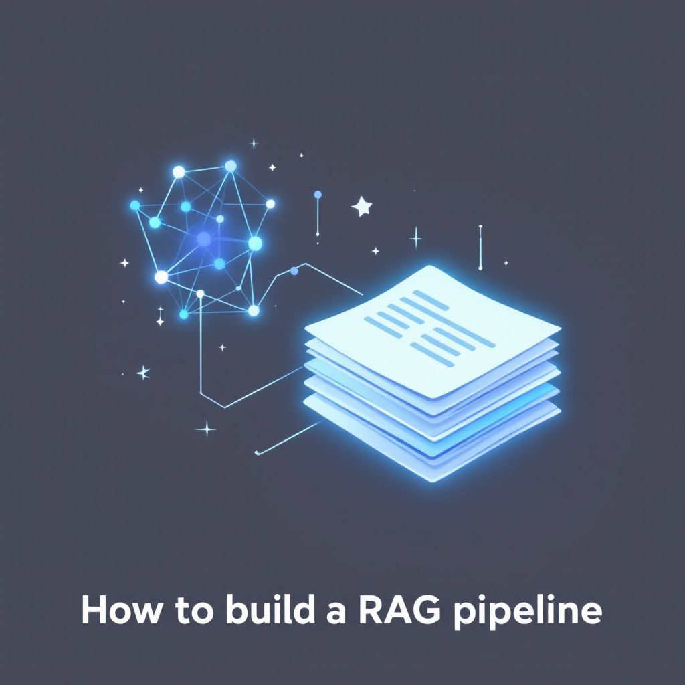

# How to build a RAG pipeline tutorial



<div align="center">
  <h3>A Next.js blog that understands its own content</h3>
  <p>Built with Next.js 14, TypeScript, and OpenAI</p>
</div>

## 🚀 Overview


This project demonstrates how to build a modern blog with an AI-powered chat interface that can intelligently discuss your blog content. It's a practical implementation of Retrieval Augmented Generation (RAG) that showcases how to:

- Create a responsive, modern blog using Next.js and TypeScript
- Implement a RAG pipeline for intelligent content retrieval
- Build a real-time chat interface that understands your blog posts
- Retrieve related entities (posts, products, services, agents, etc) 
- Augment streaming responses with data serialized in HTTP headers that your React UI can use to update the UI
- Correctly use the latest AI SDKs from Vercel, Pinecone and OpenAI 


The patterns this tutorial demonstrates can be applied to any blog or content site, include e-commerce sites, corporate properties, and more.

This codebase is part of the comprehensive [RAG Pipeline Tutorial](https://zackproser.com/blog/rag-pipeline-tutorial) that walks you through building intelligent content applications.

## ✨ Features

- **Intelligent Chat Interface**: Chat with an AI that understands your blog content
- **Real-time Content Updates**: Automatically indexes new blog posts for the RAG pipeline
- **Modern Stack**: Built with Next.js 14, TypeScript, and Tailwind CSS
- **Markdown Support**: Write posts in Markdown with front matter
- **Responsive Design**: Beautiful on all devices
- **Developer Experience**: Hot reloading, TypeScript types, and more

## 🛠 Quick Start

### Prerequisites

Before starting with this application, you must first complete the data preparation steps in the companion Jupyter notebook:

1. Visit the [RAG Pipeline Tutorial Notebook](https://github.com/zackproser/rag-pipeline-tutorial-notebook)
2. Follow the notebook instructions to prepare your vector store and necessary data

### Installation Steps

1. Clone the repository:
```bash
git clone https://github.com/yourusername/blog-starter-app.git
cd blog-starter-app
```

2. Install dependencies:
```bash
npm install
```

3. Set up your environment variables:
```bash
cp .env.example .env.local
# Add your OpenAI API key to .env.local
```

4. Run the development server:
```bash
npm run dev
```

Visit [http://localhost:3000](http://localhost:3000) to see your blog in action!

## 📚 Documentation

For a deep dive into how this works and how to build your own RAG pipeline:

- [Complete RAG Pipeline Tutorial](https://zackproser.com/blog/rag-pipeline-tutorial)

## 📦 Tech Stack

- **Frontend**: Next.js 14, React, TypeScript, Tailwind CSS
- **AI Integration**: OpenAI API
- **Content**: Markdown with Gray Matter
- **Styling**: Tailwind CSS
- **Deployment**: Vercel

## 📝 License

MIT

---

<div align="center">
  <p>Built with ❤️ as part of the <a href="https://zackproser.com/blog/rag-pipeline-tutorial">RAG Pipeline Tutorial</a></p>
</div>
